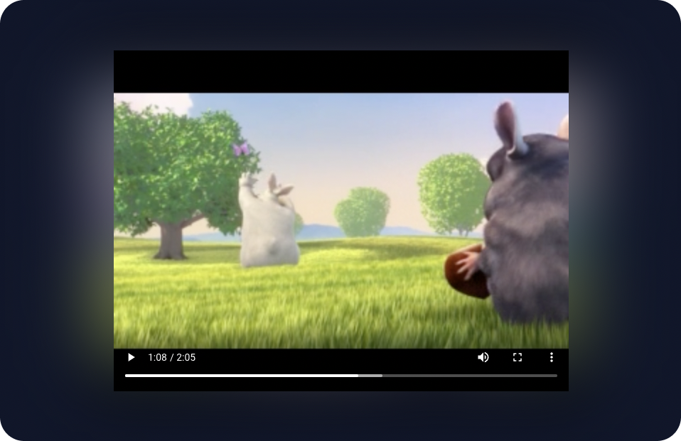

# React Ambient Player

[](https://www.npmjs.com/package/react-ambient-player)
[](https://www.npmjs.com/package/react-ambient-player)



Video player backlight changing according to video content

## Installation

```
npm install react-ambient-player
```

## Usage

```typescript jsx
import React from "react";
import AmbientPlayer from "react-ambient-player";

const App = () => {
  return (
    <AmbientPlayer
      sources={[
        {
          src: "https://interactive-examples.mdn.mozilla.net/media/cc0-videos/flower.webm",
          type: "video/webm",
        },
        {
          src: "https://interactive-examples.mdn.mozilla.net/media/cc0-videos/flower.mp4",
          type: "video/mp4",
        },
      ]}
    />
  );
};

export default App;
```

## Props

| Name       | Type                                    | Default     | Description                                       |
| ---------- | --------------------------------------- | ----------- | ------------------------------------------------- |
| sources    | `Array<{ src: string; type: string; }>` | `undefined` | Array of sources to be used by the video element. |
| interval   | `number`                                | `5000`      | Frame extraction interval in milliseconds.        |
| videoProps | `VideoHTMLAttributes<HTMLVideoElement>` | `undefined` | Props to be passed to the video element.          |

## License

MIT

## Author

<table>
<tr>
    <td align="center">
        <a href="https://github.com/yigithanyucedag">
            
            <br />
            <sub><b>Yiğithan</b></sub>
        </a>
    </td></tr>
</table>
